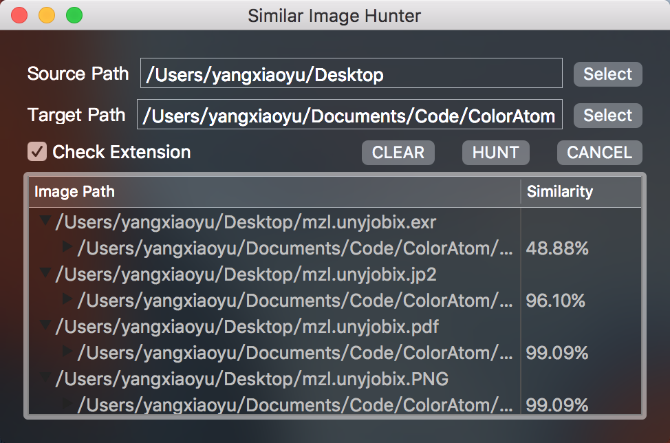

# SimilarImageHunter

Mac OS X 上的小工具，用来查找相似内容的图片。它会将 Target Path 中的图片与 Source Path 中的图片两两比较，在 Target Path 中捕获到与 Source Path 中每张图片最相似的图片。（建立 Source Path 到 Target Path 的映射）

## 使用方法

1. 点击第一行的 Select 按钮选择 Source Path
2. 点击第二行的 Select 按钮选择 Target Path
3. 点击 Hunt 按钮进行捕获相似图片
4. 在树形表中点击箭头可以展开详细映射信息
5. 双击图片路径可以打开对应图片
6. 在 Hunt 的过程中随时可以按 Cancel 按钮取消当前任务
7. 按 Clear 按钮清空当前页面所有信息
8. 勾选 "Check Extension" 则会在查找图片时检查文件后缀名，加快筛选速度

如果目标路径中有多张图片相似度相同且最大，这些图片都会被列出来。树形列表第一列的父节点内容为原始路径中的图片，子节点为目标路径中匹配到的最佳相似内容图片。列表第二列为相似度。

## 实现原理

http://yulingtianxia.com/blog/2016/01/17/search-for-similar-images/

## Release

### Mac App Store

https://itunes.apple.com/cn/app/similarimagehunter/id1122434637?mt=12

### GitHub Release

[SimilarImageHunter v1.1](https://github.com/yulingtianxia/SimilarImageHunter/releases/tag/v1.1)

## LICENSE

The MIT License.
